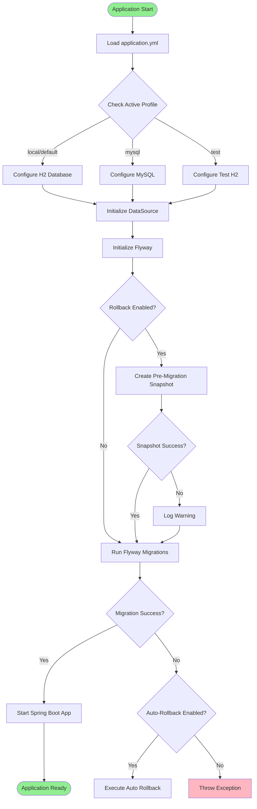
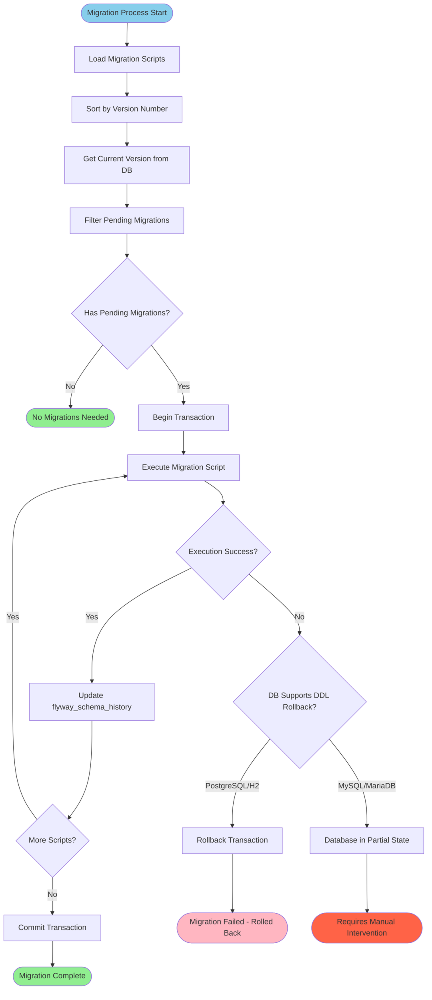
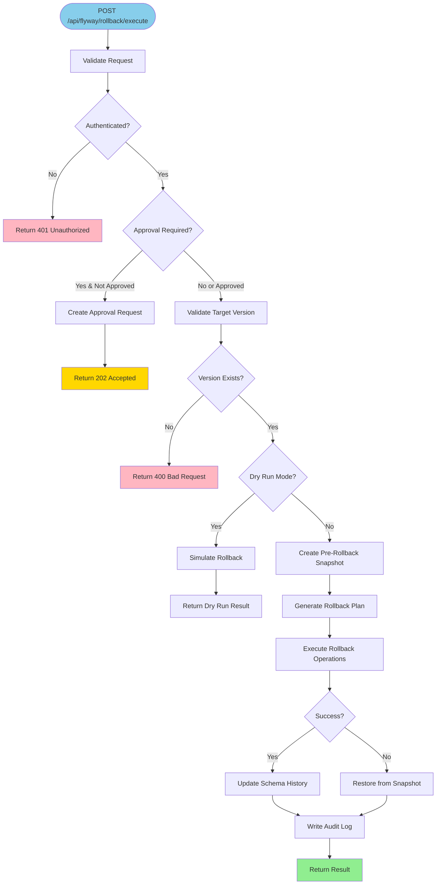
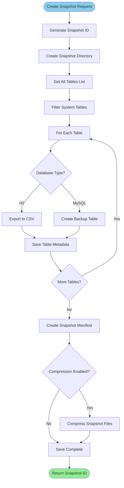
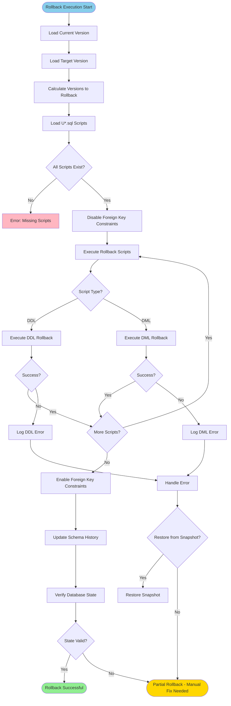
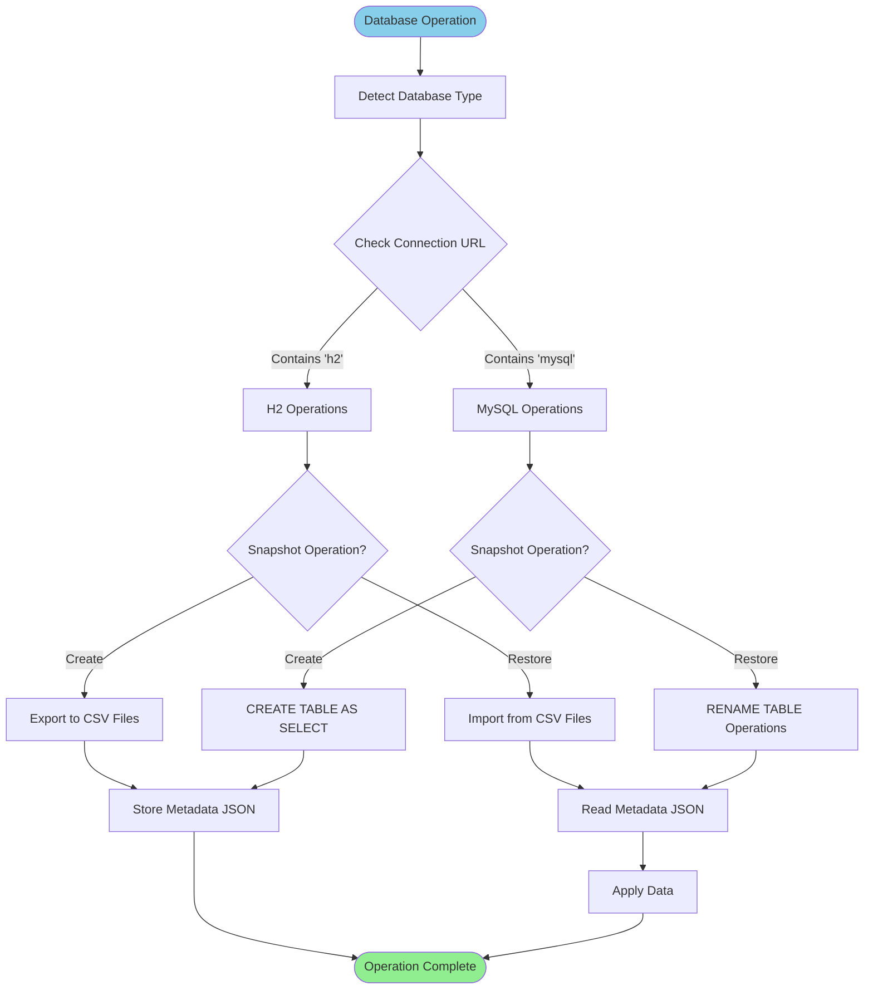
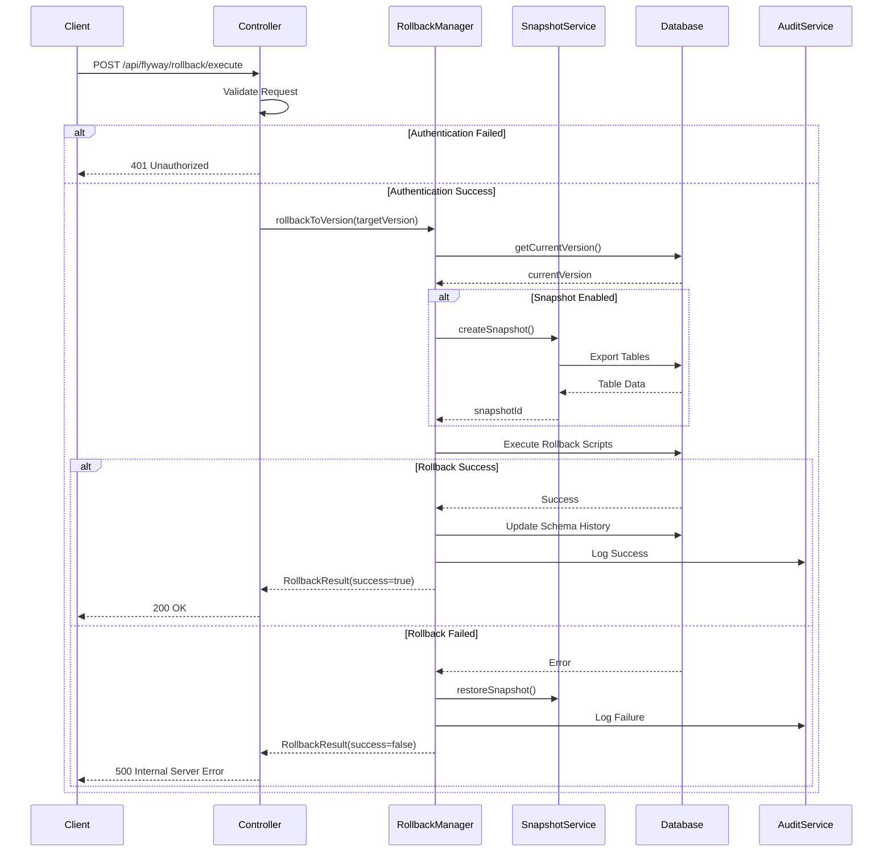
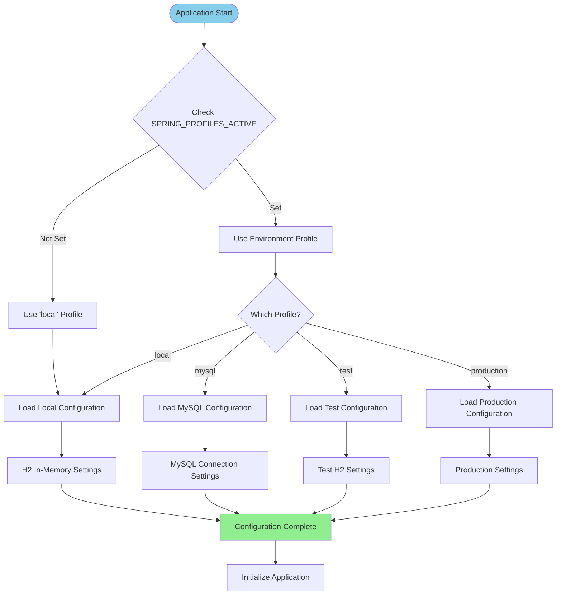
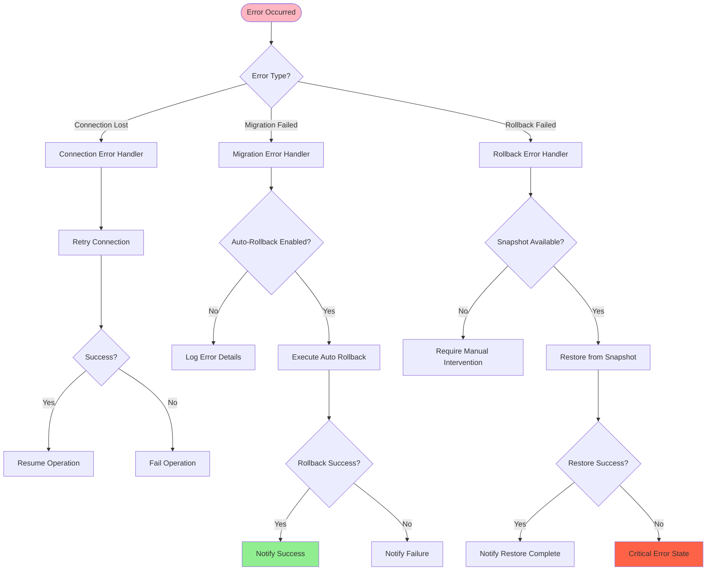
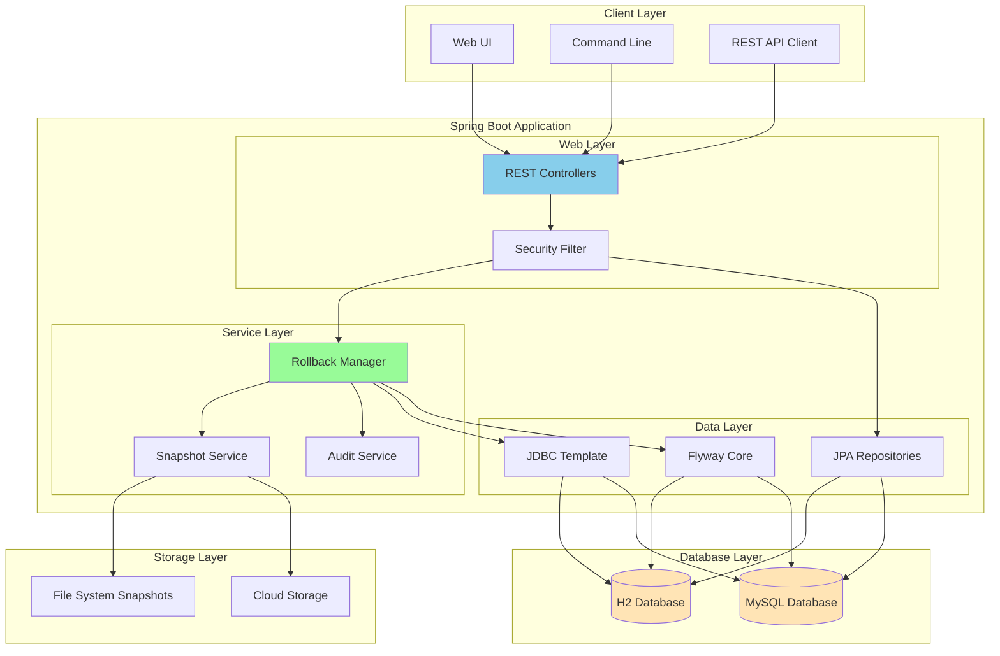

# End-to-End Flow Diagrams for Flyway Rollback Framework

## 1. Application Startup Flow

## 2. Migration Execution Flow

## 3. Rollback Request Flow (REST API)

## 4. Snapshot Creation Flow

## 5. Rollback Execution Flow

## 6. Database-Specific Operations Flow

## 7. API Request Lifecycle

## 8. Multi-Environment Configuration Flow

## 9. Error Handling and Recovery Flow

## 10. Complete System Architecture Flow

## Flow Summary

These diagrams illustrate:

1. **Startup Flow**: How the application initializes with different profiles
2. **Migration Flow**: How Flyway executes migrations with transaction support
3. **API Flow**: Complete REST API request handling for rollbacks
4. **Snapshot Flow**: How snapshots are created for different databases
5. **Rollback Flow**: Detailed rollback execution process
6. **Database Operations**: Database-specific handling
7. **Request Lifecycle**: Sequence of operations for API requests
8. **Configuration Flow**: Multi-environment configuration handling
9. **Error Handling**: Comprehensive error recovery mechanisms
10. **Architecture**: Overall system component interactions

Each flow shows decision points, error handling, and the complete path from request to response, making it easy to understand how the rollback framework operates in different scenarios.